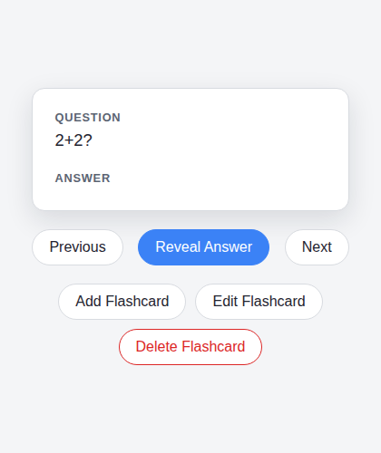
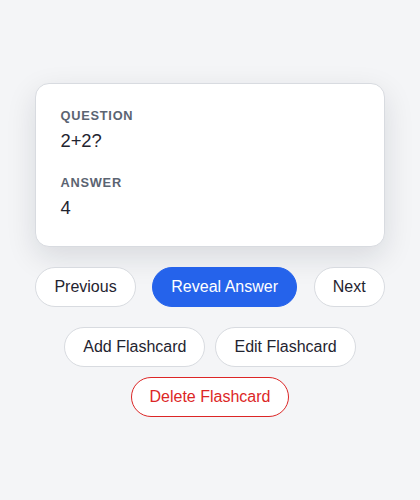

# Flashcards

Simple flashcard app in Spring Boot using Postgres for db and Thymeleaf for frontend template engine.

Requires Java 21+.

| Question | Answer revealed |
| --- | --- |
|  |  |

## How to run
1. Clone the repo
2. Install Postgres and run the CREATE statement in `src/main/resources/CreateTable.sql`. This will create the database and table.
Optionally populate the table as shown with the INSERT example in the same file.
3. Run the app in your IDE or with `./gradlew build` to build with tests.
4. Navigate to `localhost:8080/flashcards` in your browser.

By default the app connects to `jdbc:postgresql://localhost:5432/postgres` with username/password
`postgres`/`postgres`. Override any of these via the `SPRING_DATASOURCE_URL`, `SPRING_DATASOURCE_USERNAME`,
and `SPRING_DATASOURCE_PASSWORD` environment variables.

## CI
Every push to `main` and every pull request runs `./gradlew build` (compile + full test suite) against a
Postgres service container via [GitHub Actions](.github/workflows/ci.yml).
